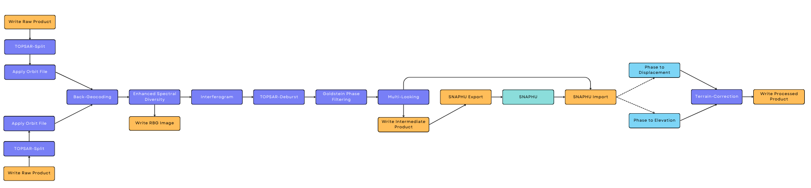

# Landgate-ASDAF Project
## Sentinel-1 InSAR Image Processing with SNAPPY
Author:
- Calvin Pang (calvin.pang@curtin.edu.au)

## Contents
- [Overview](#overview)
- [Setup (Conda)](#setup-steps-conda)
- [References](#references)
___
## Overview
Processing pipeline for DEM Generation and Displacement Mapping from Sentinel-1 Interferometric Wide Swath products with ESA Sentinal Application Platform (SNAP 8.0) and Python 3.9.

___
## Setup (Conda)
*Assuming you have already setup your Nimbus VM*
1. Create a conda environment   
  `conda create -n snap8 -c terradue snap=8.0.0 snapista`
2. Activate the environment   
  `conda activate snap8`
3. Install libgfortra5 on your machine    
  `sudo apt install libgfortra5`
4. Configure SNAP Python API (SNAPPY) to use 80% available system memory    
    - Navigate to the directory containing your conda environment (e.g. `~/mambaforge/envs/snap8`)
    - Modify `.../snap/.snap/snap-python/snappy/snappy.ini` and set `java_max_mem` to 28G
    - Modify `.../snap/etc/snap.properties` and set `snap.jai.tileCacheSize` to 28672
5. Download SNAPHU
  `wget https://web.stanford.edu/group/radar/softwareandlinks/sw/snaphu/snaphu-v2.0.5.tar.gz`
6. Unzip SNAPHU
  `tar -xvzf snaphu-v2.0.5.tar.gz`
7. Make SNAPHU
  `cd snaphu-v2.0.5.tar.gz/src | make`
8. Add SNAPHU to System PATH by adding the following line to your `.bashrc` profile.  
  `export PATH=$PATH:/home/ubuntu/snaphu-v2.0.5/bin`

Note: Modify the paths as necessary depending on your machine.

## Usage
*Assuming that you have already downloaded your products.*
1. Modify `config.py` as required.
2. Ensure you are in the appropriate conda environment  
  `conda activate snap8`
3. Run `python main.py`
___
## Output Product Information
DEM Products
- Band 1: displacement_VV
- Band 2: coherence_VV
- Band 3: phase_VV

Displacement Products
- Band 1: elevation_VV
- Band 2: coherence_VV
- Band 3: phase_VV

## References
1. [DEM Generation with Sentinel-1](http://step.esa.int/docs/tutorials/S1TBX%20DEM%20generation%20with%20Sentinel-1%20IW%20Tutorial.pdf)
2. [Displacement Mapping with Sentinel-1](http://step.esa.int/docs/tutorials/S1TBX%20TOPSAR%20Interferometry%20with%20Sentinel-1%20Tutorial_v2.pdf)
3. [Phase Unwrapping with SNAPHU](https://step.esa.int/main/snap-supported-plugins/snaphu/)
4. [SNAP GPT](http://step.esa.int/docs/tutorials/SNAP_CommandLine_Tutorial.pdf)